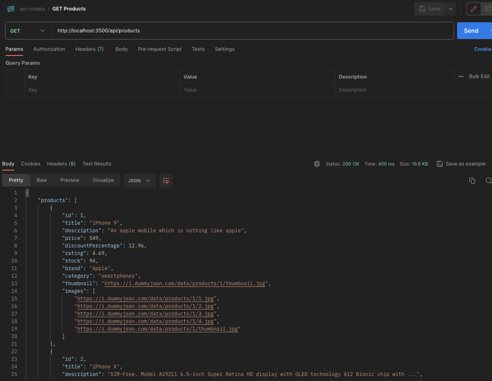
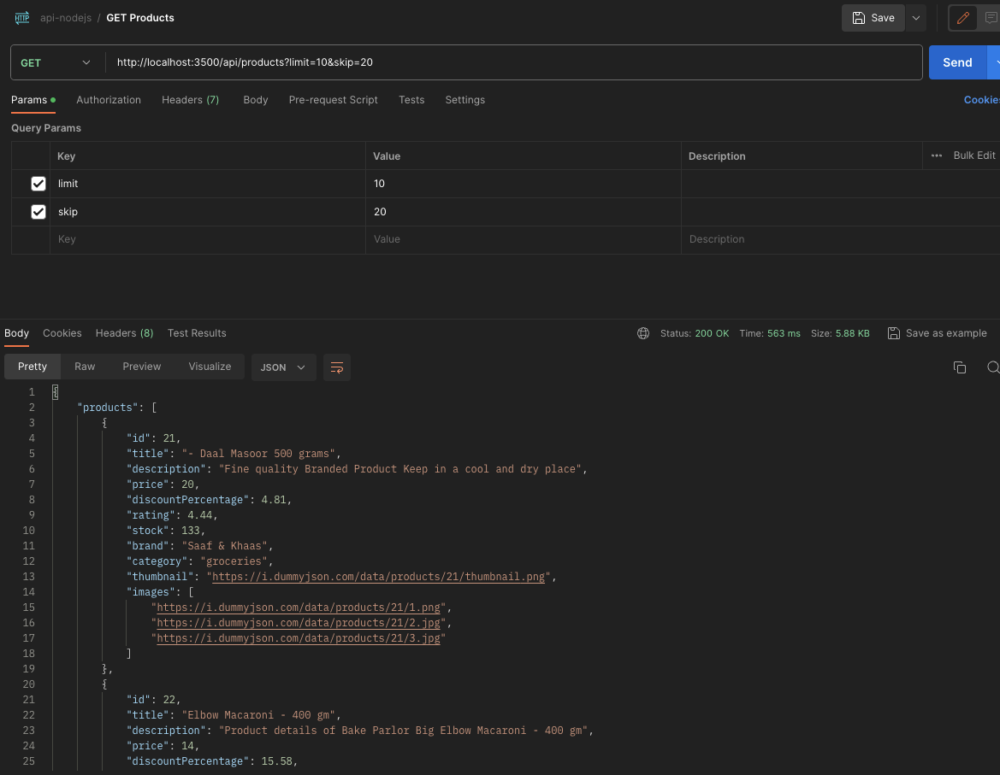
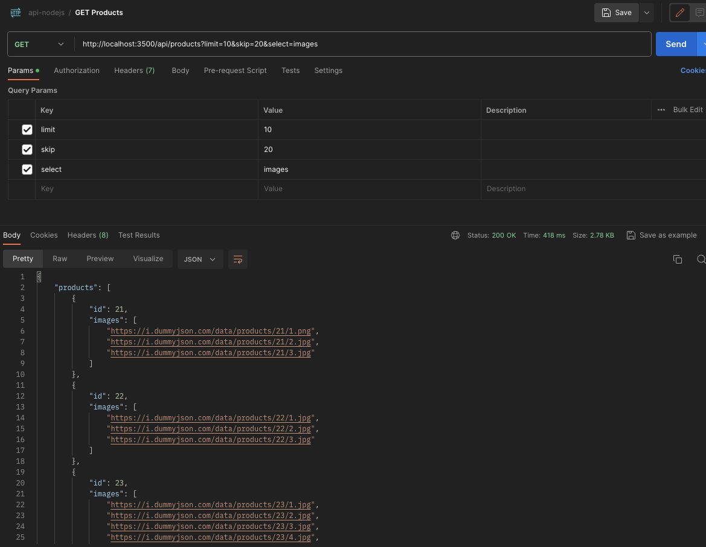
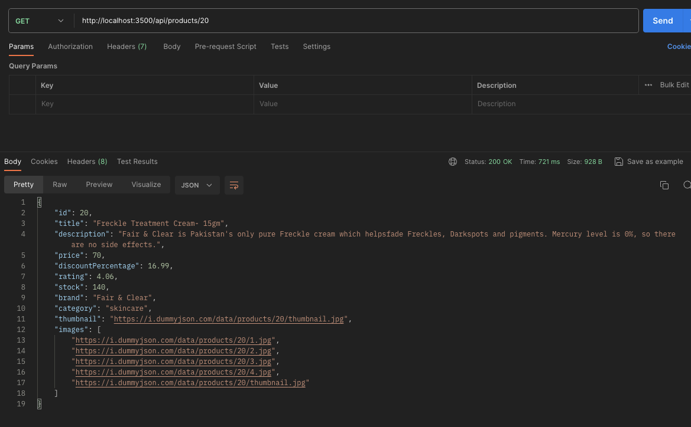
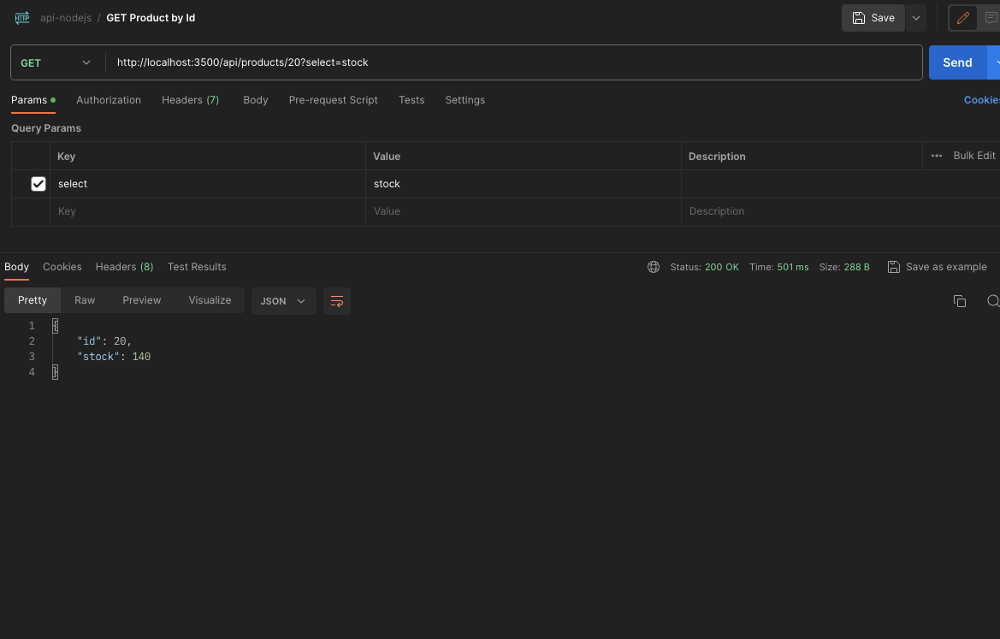

# API nodejs with dummy endpoint

Example of API using nodejs and express with dummy endpoint https://dummyjson.com/docs/products

## Prerequisites
1. If you have Node.js installed on your machine, go to point 4. Instead please download it with the following link [Download Node.js and npm](https://nodejs.org/en/download). I used npm the default package manager for the node.js javaScript runtime.

2. In the terminal type the below command and press **Enter key**. The version we have installed of Node.js should appear (in my case v14.21.3)
    ```bash
    node -v
    ```
3. In the terminal type the below command and press **Enter key**. The version we have installed of npm should appear (in my case 6.14.18)
    ```bash
    npm -v
    ```

4. So, let's install it, in the terminal type the following command and press **Enter key**.
    ```bash
    npm i
    ```
## Use

1. Run and view the changes locally with the following command.
    ```bash
    npm run start:dev
    ```
2. go to http://localhost:3500/api/products if you didn't change the port in the .env file (_PORT=3500_)


## How to use

You can get one o more products from the API, 

### 1. the response is like the interfaces in Typescript shown below, **Products** interface are for products and **Product** interface for one:

```typescript
export interface Products {
  limit: number;
  products: Product[];
  skip: number;
  total: number;
};

export interface Product {
  id: number;
  brand?: string;
  category?: string;
  description?: string;
  discountPercentage?: number;
  images?: string[];
  price?: number;
  rating?: number;
  stock?: number;
  thumbnail?: string;
  title?: string;
};
```

### 2. Get all **products**

  - You can get all products from the client side:
    ```javascript
    fetch('http://localhost:3500/api/products')
    .then(res => res.json())
    .then(console.log);
    ```
    The response should be like the interface **Products** as shown previously in the point 1.

  - Example using postman with the endpoint http://localhost:3500/api/products

    

### 2. (limit) and (skip) query params
  You can pass "limit" query param number between [0 - 100] cause the maximum of products are 100.
  
  The "skip" query param number between [1-99].

  These params are to limit and skip the results for pagination, and use limit=0 to get all items.

  - For example: In client side we can pass limit=10 & skip=20 like the code below, the response should be like **Products** interface shown previously in the point 1.

    ```javascript
    fetch('http://localhost:3500/api/products?limit=10&skip=20')
    .then(res => res.json())
    .then(console.log);
    ```
  
  - Example using postman with the endpoint http://localhost:3500/api/products?limit=10&skip=20

    

### 3. (Select) query param
  You can pass "select" as query param with comma-separated values to select specific data. (select=images,title)

  - Example in client side
  ```javascript
  fetch('http://localhost:3500/api/products?select=images')
  .then(res => res.json())
  .then(console.log);
  ```

  - Example using postman with the endpoint http://localhost:3500/api/products?select=images

    

### 4. With a **single product**
  You can pass the ID, that is any number between 1 and 100 (Total of products) after the path products, for example ```http://localhost:3500/api/products/{ID}```

  - Example in the client side with the ID=1:
    ```javascript
    fetch('https://dummyjson.com/products/1')
    .then(res => res.json())
    .then(console.log);
    ```

  - Example using postman using ID=20, with the endpoint http://localhost:3500/api/products/20

    

  - You can pass a filter for example **_stock_**. http://localhost:3500/api/products/20?select=stock

    


## Dependencies

```JSON
{
  "axios": "^1.6.0",
  "cors": "^2.8.5",
  "express": "^4.18.2",
  "express-validator": "^7.0.1"
  }
```

### Dev Dependencies
```JSON
{
  "@types/cors": "^2.8.16",
  "@types/express": "^4.17.21",
  "dotenv": "^16.3.1",
  "nodemon": "^3.0.1",
  "ts-node-dev": "^2.0.0",
  "typescript": "^5.2.2"
  }
```

## Author
Developed with all ❤️ by Andres Araque
